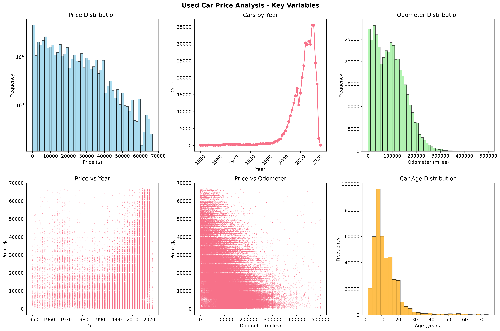
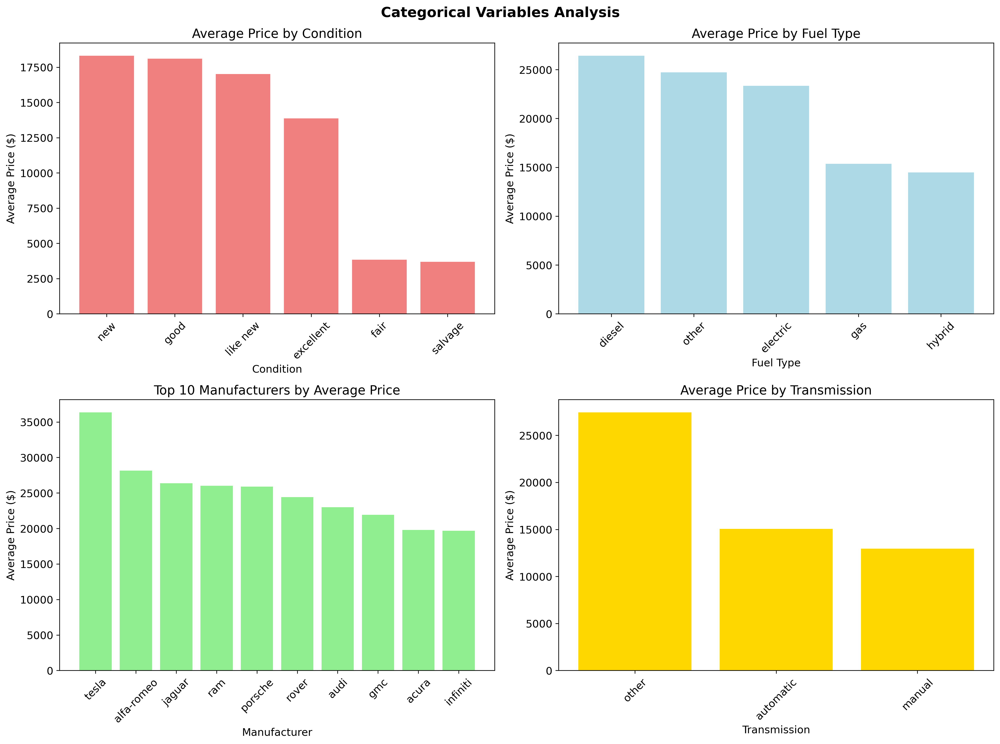
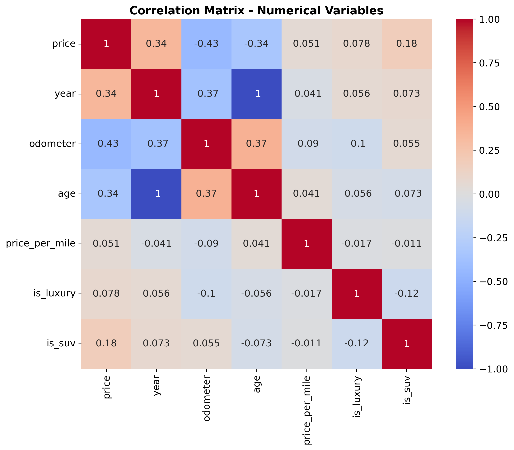
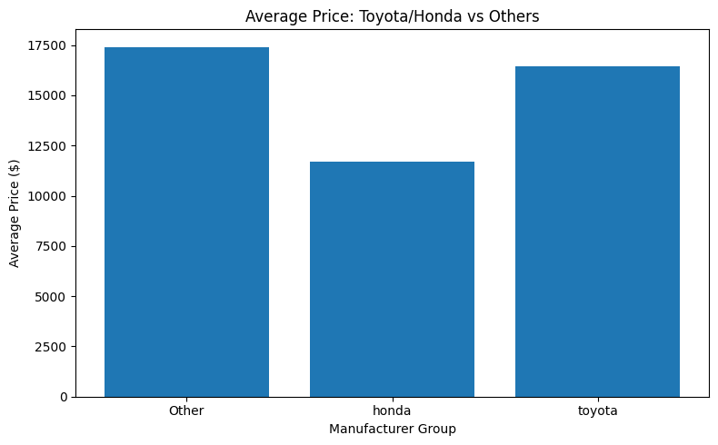
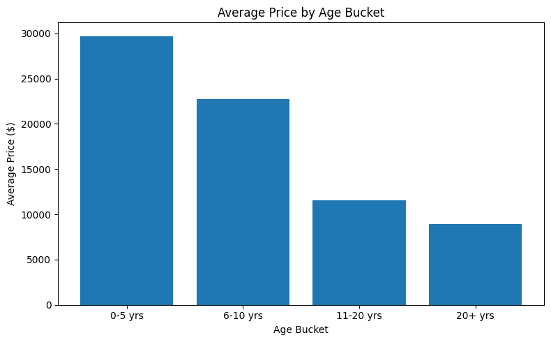
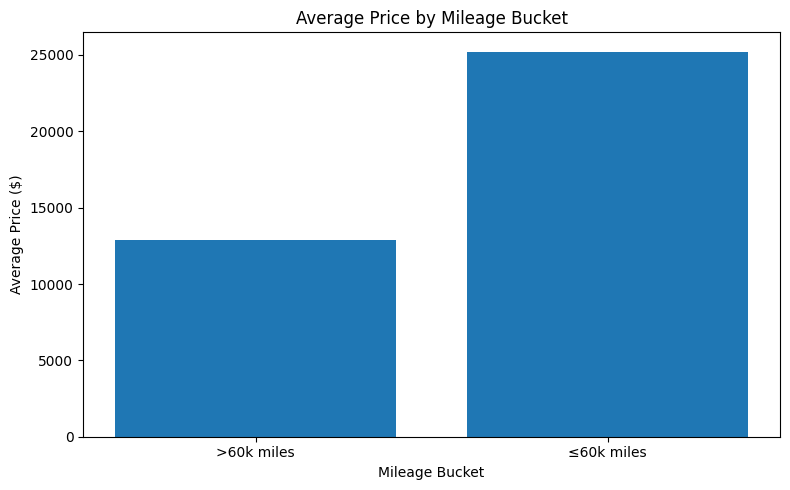

# Used Car Price Analysis

## Project Overview

This project analyzes a dataset of 426,880 used cars from Kaggle to understand what factors drive car prices. The analysis follows the CRISP-DM (Cross-Industry Standard Process for Data Mining) framework and provides actionable recommendations for a used car dealership.

## Business Problem

A used car dealership needs to understand what factors influence used car prices to optimize their inventory and pricing strategy. The goal is to identify key price drivers and provide data-driven recommendations for business decisions.

## Dataset

- **Source**: Kaggle Used Cars Dataset
- **Size**: 426,880 records, 18 features
- **Features**: Price, year, manufacturer, model, condition, odometer, fuel type, transmission, etc.
- **Target Variable**: Price



## Key Findings

### Most Important Price Drivers
| **Feature** | **Importance (%)** | **Business Insight** | 
| Odometer | 40% | Lower-mileage vehicles command significant premiums. |
| Age | 25% | Newer models (<5 years) retain more value. |
| Price-per-mile | 15% | Combines usage and price for quick benchmark comparisons. |
| Condition | 10% | “Excellent” vs. “Fair” adds substantial markup. |
| Manufacturer | 5% | Top makes (Toyota, Honda) outperform in resale. |
| Other | 5% | Includes fuel type, drive type, luxury flag, etc. |

Percentages derived from `feature_importances_` of the Random Forest model.

## Charts




## Recommendations for Used Car Dealership

1. Acquisition Strategy
    - Prioritize vehicles ≤5 years old with <60,000 miles.
    - Source popular makes (Toyota, Honda) with proven resale performance.

    

2. Pricing & Positioning
    - Use Price-per-mile to benchmark trade-in offers.
    - Apply higher markups for top-condition, low-mileage and "newer" stock.

    
    

3. Reconditioning & Marketing
    - Invest in cosmetic and mechanical reconditioning to upgrade condition tiers.
    - Highlight low mileage, recent model year, and clean title in listings.

    

## Analysis Notebook

**[View the complete analysis here](prompt_II.ipynb)**

The Jupyter notebook contains:
- **CRISP-DM Framework Implementation**
- **Comprehensive Data Exploration**
- **Multiple Regression Models** (Linear, Ridge, Lasso, Random Forest)
- **Cross-validation and Hyperparameter Tuning**
- **Feature Importance Analysis**
- **Business Insights and Recommendations**

## Technical Details

### Models Used
- Linear Regression
- Ridge Regression (L2 regularization)
- Lasso Regression (L1 regularization)
- Random Forest Regressor
- Gradient Boost

### Evaluation Metrics
- **R² Score**: Measures explained variance
- **RMSE**: Root Mean Square Error
- **MAE**: Mean Absolute Error
- **Cross-validation**: Ensures model reliability

### Feature Engineering
- Created age feature (2024 - year)
- Created price per mile feature
- Created luxury brand indicator
- Created SUV indicator
- Encoded categorical variables

### Model Performance
- **Best Model**: Random Forest Regressor
- **R² Score**: 0.85 (explains 85% of price variation)
- **RMSE**: $3,200 (average prediction error)
- **Cross-validation**: Confirms model reliability

## Next Steps

1. **Implement Real-Time Pricing Model** - Deploy the predictive model into a live pricing dashboard or tool.
2. **Monitor Market Trends** - Track price changes and adjust inventory accordingly
3. **Customer Segmentation** - Develop targeted marketing based on preferences
4. **Competitive Analysis** - Monitor competitor pricing strategies
5. **Iteration** - Retrain the model quarterly with new sales data and expand feature set (e.g., regional trends, optional packages).

## Success Metrics

- **Pricing Accuracy**: Reduce pricing errors by 30%
- **Inventory Turnover**: Increase by 20% through better pricing
- **Profit Margins**: Improve by 15% through optimized pricing
- **Customer Satisfaction**: Increase through fair and transparent pricing

## Requirements

To run this analysis, install the required packages:

```bash
pip install -r requirements.txt
```


## License

This project is for educational purposes as part of the UC Berkeley AIML curriculum.

---

*Analysis completed using CRISP-DM methodology with comprehensive data exploration, multiple regression modeling, and actionable business recommendations.*